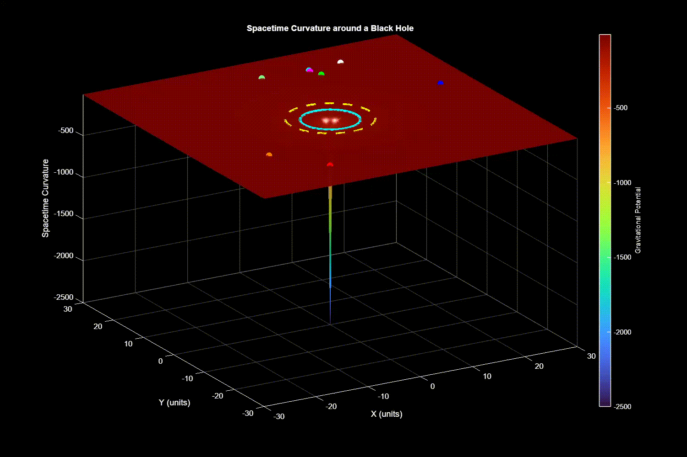

# Black Hole Light Path Simulation 🕳️

## 📖 Overview

This project is a MATLAB-based simulation engine designed to model the trajectory of light (photons) as they navigate the extreme gravitational curvature surrounding a black hole. 

Developed as part of the **Modelling and Simulation** module at UCL, this project implements General Relativity concepts to visualize how light bends near the Event Horizon and Photon Sphere. The simulation was developed by a team of three and achieved a final grade of **95%**.

## 🚀 Key Features

* **Geodesic Ray Tracing:** numerical integration of the geodesic equations to plot photon paths.
* **Relativistic Physics:** Implementation of **Christoffel symbols** to accurately calculate the spacetime curvature.
* **Visualization:** Renders key astronomical boundaries including the **Event Horizon** and the **Photon Sphere**.
* **Verification:** Simulation results were validated against standard theoretical physics models to ensure accuracy.

## 🧮 Mathematical Framework

The simulation models the path of a photon in a Schwarzschild metric (non-rotating black hole). The core of the engine solves the **Geodesic Equations**:

$$\frac{d^2 x^\mu}{d\lambda^2} + \Gamma^\mu_{\alpha\beta} \frac{dx^\alpha}{d\lambda} \frac{dx^\beta}{d\lambda} = 0$$

Where:
* $x^\mu$ represents the spacetime coordinates.
* $\Gamma^\mu_{\alpha\beta}$ represents the **Christoffel Symbols** (connection coefficients) derived from the metric tensor.

By numerically solving these differential equations in MATLAB, we determine the path of light rays affected by the massive gravitational field.

## 🛠️ Tech Stack

* **Language:** MATLAB
* **Focus:** Numerical Analysis, Computational Physics, Vector Calculus

## 📊 Results & Visualization

The simulation successfully demonstrates:
1.  **Gravitational Lensing:** Light bending around the black hole.
2.  **Photon Capture:** Light rays that cross the Event Horizon and do not return.
3.  **The Photon Sphere:** Light rays that enter a circular orbit around the black hole ($1.5 \times$ Schwarzschild Radius).

